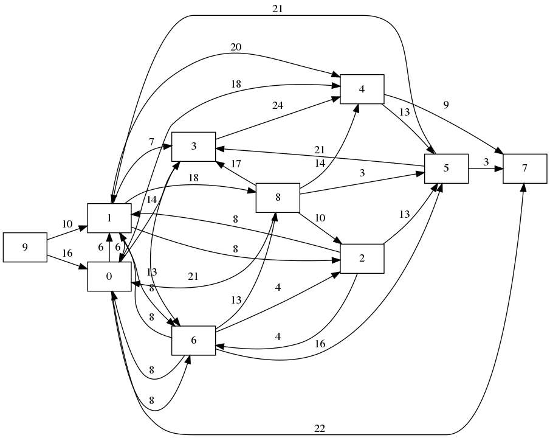
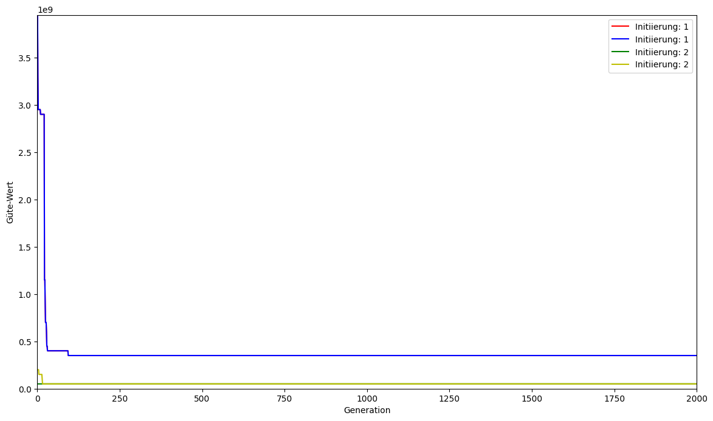
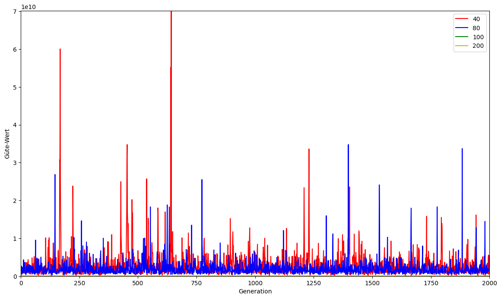
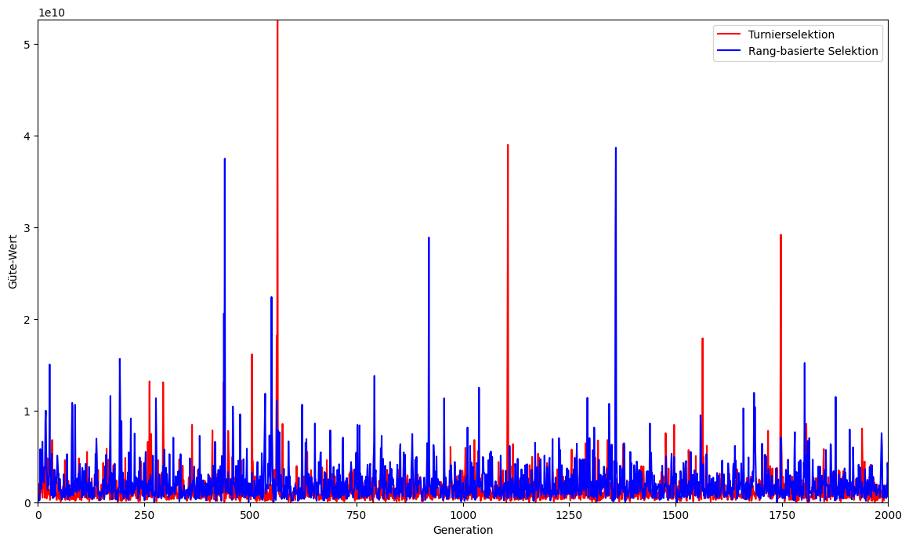
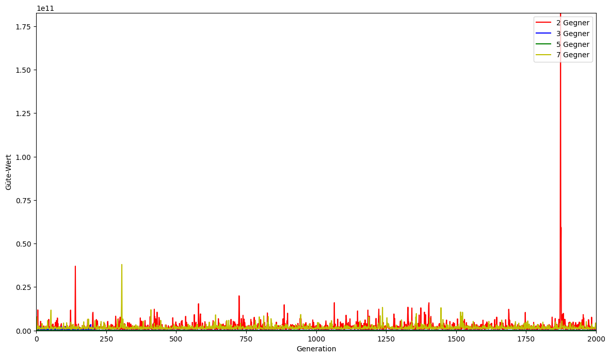
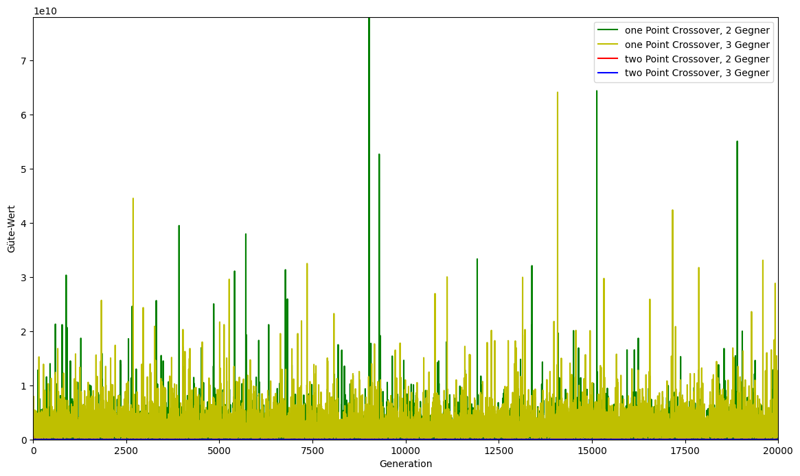
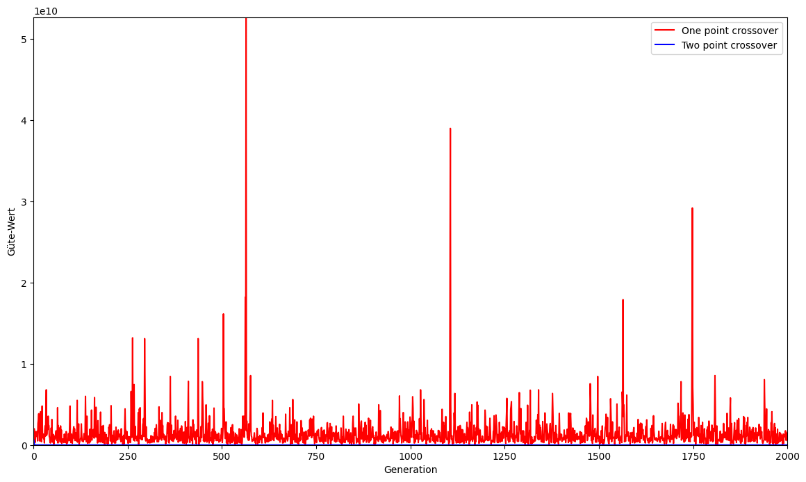
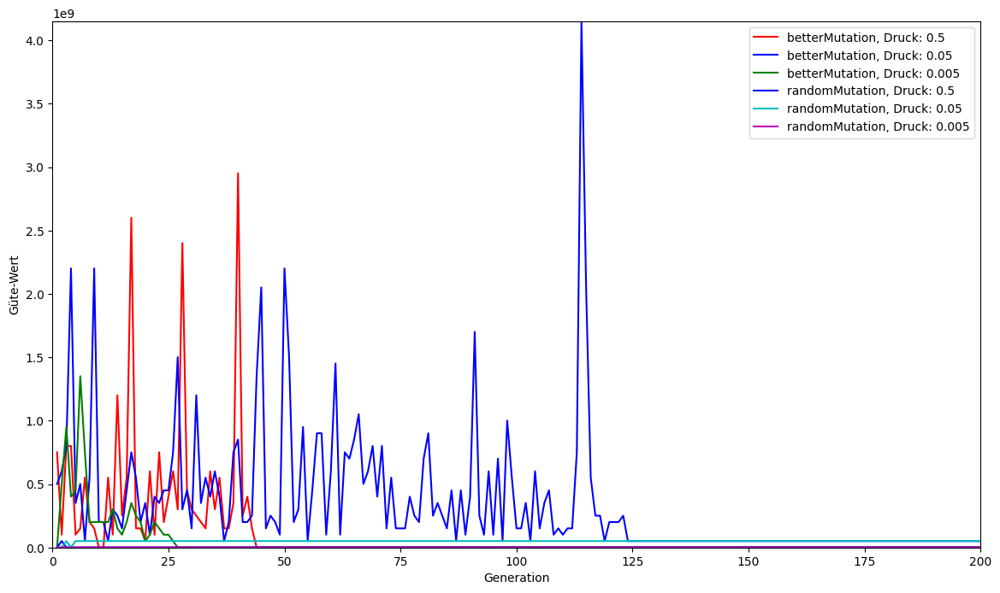
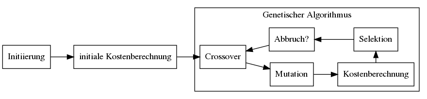
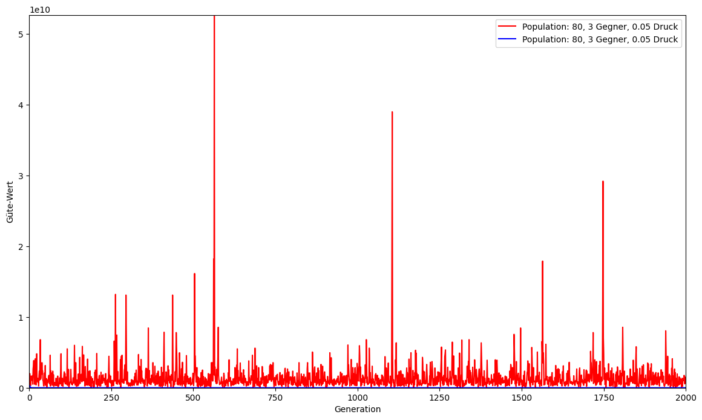

---
title: 'Lösung von Minimum-Kost Network-Flow-Problemen mit evolutionären Algorithmen'
author: 
- Tom Wegener
date: \today
link-citations: true
...
\setmathfont[range=\setminus]{texgyrebonum-math.otf}
\pagenumbering{gobble}
\pagebreak

\tableofcontents
\listoffigures

\pagebreak
\pagenumbering{arabic}

# Das Single Source Uncapacitated Concave Minimum-Cost Network Flow Problem

Das Single Source Uncapacitated Concave Minimum-Cost Network Flow Problem (SSUC - MCNFP) ist ein Problem bei dem aus einer Quelle mehrere sog. Customer mit Waren versorgt werden müssen. Diese Versorgung geschieht über einen gerichteten Graphen bestehend aus Kanten, die über eine mit verschiedenen Kosten versehen sind. Das Ziel ist es, möglichst geringe Gesamtkosten zu verursachen während weiterhin alle Customer mit ihren benötigten Waren (Demand) versorgt werden. Dementsprechend ist es ein Minimierungsproblem.

Mathematisch lässt sich das Problem folgendermaßen darstellen:

(1) $$ min: \sum_{(i,j) \in A } g_{ij} (x_{ij}, y_{ij}) = cost $$
(2) mit: $$ g(x_{ij}) = -a_{i,j} *x_{i,j}^2+b_{i,j}*x_{i,j}+c_{i,j} $$
(3) $$ x_{i,j} \in M, \forall (i,j) \in A $$
(4) $$ x_{i,j} \geq 0, \forall (i,j) \in A $$
(5) $$ \forall j \in N \smallsetminus {t} \sum_{i|(i,j) \in A } x_{ij}, y_{ij} - \sum_{(j,k) \in A } x_{jk} = storage_j $$
(6) $$ x_{i,j} \leq storage_i, \forall (i,j) \in A $$

In (1) wird die Kostenfunktion beschrieben, die Gesamtkosten sind die Summe aller Kosten der Kanten des Netzwerkes. Dabei ist $g(x_{i,j})$ die Kostenfunktion, die in (2) erklärt wird. Die Werte für $a_{i,j}$, $b_{i,j}$ und $c_{i,j}$ stammen dabei aus dem Datensatz der OR-Library. Aufgrund dieser Werte wurde auch der die Menge der existierenden Kanten $M$ erzeugt, die in (3) genutzt wird. In (3) wird beschrieben, dass nur existente Kanten genutzt werden sollen. (4) bedeutet, dass keine negative Mengen über den Kanten geschickt werden dürfen, damit der Graph weiterhin gerichtet bleibt.
$storage_{i/j}$ ist eine Angabe, wie viele Waren an einem Punkt angekommen sind und auch wieviele Waren von diesem Punkt aus verteilt werden können (5). Dabei ist Anfangs der Demand, als negativer $storage_{i/j}$ gesetzt.

## OR-Library Testdaten

Die Testdaten sind von der Seite "OR-Library" von J. E. Beasley, unter <http://people.brunel.ac.uk/~mastjjb/jeb/orlib/netflowccinfo.html> ist es möglich eine Datensatz-Sammlung verschieden großer Datensätze herunterzuladen.

Die Daten werden als einfache, unterteilte Liste bereitgestellt und enthalten die Anzahl an Knoten, einen Demand der Knoten und anschließend verschiedene Kosten für die Kanten. Jedoch können die Daten über Funktionen in drei Matrizen umgewandelt werden. Der letzte Knoten hat keinen Demand, dementsprechend kann er als Quelle angesehen werden.

Die Kosten für die Kanten sind in drei verschiedene Komponenten unterteilt, die Komponente ist A, welche variabel ist und für eine nicht-vorhandene Kante den Wert 0 hat. Die zweite Komponente ist B, die ebenfalls variabel ist, aber für eine nicht-vorhandene Kante den Wert 50000000 annimmt. Die letzte Komponente ist C, die unabhängig von dem sog. Flow ist.

Zusätzlich werden drei verschiedene polynomiale konkave Funktionen bereitgestellt, die als Teil einer Güte-Funktion genutzt werden können. In diesem Projekt wird die erste der drei Kosten-Funktionen genutzt.

Der Graph, der aus der Datei "CCNFP10g1a.txt" entsteht, wird in Abbildung 1 gezeigt.

\newpage

# Hillclimbing im Netzwerk

Der Hillclimbing-Algorithmus basiert auf der Annahme, dass in der Nachbarschaft eines Individuums ein besseres Individuum gefunden werden kann. Zusätzlich basiert er auf der Annahme, dass ausgehend von diesem Individuum ein weiteres gefunden werden kann. In diesem Fall ist das Individuum ein sog. Flow, also wieviele Waren über welche Kante transportiert werden. Dabei wird der Flow in diesem Fall im Programm durch eine Matrix dargestellt.

Das Individuum ist ein struct, also ein Objekt, das einerseits die Flow-Matrix des Individuums beinhaltet, aber außerdem noch den Demand der einzelnen Knoten sowie eine aktuelle Verteilung der waren auf die Knoten, sowie den aktuellen Güte-Wert.

Die Flow-Matrix des Individuums wird durch eine Funktion initialisiert, die verschiedene Sachen wie das Vorhandensein von Kanten, den sog. Demand und auch die Quellenkapazität berücksichtigt. Die Quellenkapazität wird dabei über die Summe der Demands berechnet, da sie nur den Demand befriedigen muss. Die Position der Kanten wird über die Kosten-Matrizen berechnet. Der Demand wird als negatives Lager berücksichtigt, der Überschuss dient anschließend als Obergrenze für eine Zufallsfunktion, die die restlichen Waren weiterverteilt. Anschließend wird der Güte-Wert berechnet.

Der Nachbar wird über eine Funktion gefunden, die genau die gleichen Faktoren berücksichtigt. Jedoch ist der Anfangspunkt nicht die Quelle, sondern eine zufällig ausgewählte Kante.
Anschließend werden alle folgenden Punkte über eine Zufallsfunktion mit dem Überschuss als Obergrenze neu verteilt.
Dadurch sind zwar Nachbarn relativ weit voneinander entfernt, aber die Chance tatsächliche Verbesserungen zu erreichen ist deutlich erhöht.
Statt Güte-Werten, die konstant im neun- bis zwölf-stelligen Bereich sind, wurden dadurch auch Werte im oberen sechs-stelligen Bereich gefunden.
Diese sind jedoch nicht zwangsweise in den Messreihen enthalten, da zu diesem Zeitpunkt noch keine Daten gespeichert wurden.

Der Gütewert wird über die oben genannte Funktion berechnet. Zusätzlich gibt es jedoch einen Strafterm, der von den an den Knoten gespeicherten Werten abhängig ist.

Wie es beim Hillclimbing üblich ist, werden die Gütewerte der Individuen verglichen und für das Individuum mit dem besseren, also kleineren, Gütewert wird ein neuer Nachbar gefunden.
Dann wird erneut verglichen und wieder für das Individuum mit dem besseren, also kleineren Gütewert ein neuer Nachbar gefunden jedoch unabhängig ob das bessere Individuum schon in der vorherigen Iteration der Vorgänger war.

Die Grafik zeigt den Iterationsschritt und den Fitness-Wert des Individuums. An der Grafik lässt sich erkennen, dass der Hillclimb-Algorithmus relativ schnell zu einem Wert kommt von dem er nicht mehr bessere Werte erreicht.

\newpage

# Evolution im Netzwerk

Die Evolution im Netzwerk wurde über einen genetischen Algorithmus versucht, greift aber auch teilweise auf die gleichen oder abgewandelte Funktionen des Hillclimbing-Algorithmus zu.
Jedoch wurden auch verschiedene Funktionen ausprobiert, die unabhängig von dem Hillclimb-Algorithmus entstanden sind.

Generell wurde die Kosten-Funktion beibehalten, die weiterhin eine Güte zurückgibt, die zu minimieren ist. Der Strafterm wurde auch beibehalten.

In den Grafiken werden immer die besten Individuen der Population betrachtet.

## Abbruchbedingungen

Es gibt für den genetischen Algorithmus in diesem Fall zwei Abbruchbedingungen.
Die eine Abbruchbedingung ist an die Anzahl an Generationen geknüpft, die über die cfg.yml eingestellt werden können.
Danach gibt der Algorithmus das beste Individuum aus.

Die zweite Abbruchbedingung ist abhängig von den Güte-Werten. Unter bestimmten Bedingungen können diese sehr hoch werden und sind größer als die Implementation erlaubt. Da go jedoch in der Version 1.14.2 dann nicht abbricht, sondern der Wert als ein anderer negativer Wert interpretiert wird, wird der Algorithmus abgebrochen falls ein Güte-Wert negativ wird. Der Algorithmus wird dann abgebrochen, weil die Wahrscheinlichkeit wieder gute Werte zu erlangen niedrig ist.

Es gibt keine Abbruchbedingung, die den Algorithmus bei einem bestimmten Minimalwert abbricht, weil bei diesem Problem kein Optimalwert nicht bekannt ist.

## Erzeugen einer Population

Die Population wurde über eine Funktion erzeugt, die, je nach eingestellter Populationsgröße, eine feste Anzahl an Individuen mit der gleichen Funktion, wie die Individuen des Hillclimb-Algorithmus, erzeugt.
Dadurch entsteht eine Population, die einerseits relativ niedrigen Gütewerte hat, aber noch verbessert werden kann.
Es wurde sich auch hier gegen eine komplett zufällige Initiierung entschieden, da diese oft verhältnismäßig schlechte Gütewerte produziert, die teilweise den Rahmen des Datentyps gesprengt hat und dann als negativer Wert interpretiert wurden, die dann als besonders gut bewertet wurden.
Mit Hilfe der zweiten Abbruchbedingung wurde eine Verfälschung in Testläufen verhindert.

An der Grafik ist erkennbar, dass eine Populationsgröße von 40 die meiste Varianz der besten Individuen bietet, während die Populationsgrößen 100 und 200 relativ schnell das Optimum gefunden haben. In den folgenden Auswertungen werden deshalb als eine Art Kompromiss die Populationsgröße von 80 verwendet.

## Selektion der besten Flows

Für die Selektion wurden verschiedene Selektionsarten ausprobiert.
Einerseits wurde die Rang-basierte Selektion ausprobiert, die in der Vorlesung erwähnt wurde:

$$ PR[A^{(i)}] = \frac{2}{r} (1- \frac{i-1}{r-1})$$

Jedoch ist diese für Selektion für Populationsgrößen von 2000 nicht gut geeignet, da das beste Individuum nur eine Auswahl-Wahrscheinlichkeit von 1/1000 erreichen kann. Bei einer Populationsgröße von 80 ist dieser Wert jedoch bereits 1/40.
Dadurch haben schlechtere Individuen eine höhere Chance für die nächste Generation ausgewählt zu werden.
Mit der Rang-basierten Selektion wurde mehrmals die zweite Abbruchbedingung erreicht.

Als Alternative dazu wurde eine Abwandlung der Turnier-Selektion genutzt, die jedes Individuum gegen eine eingestellte Anzahl an zufällig ausgewählten Individuen antreten lässt und diese ersetzt, wenn es gewinnt.
Diese Selektion erreicht auch Werte, die niedriger sind als die Werte der Rang-basierten Selektion.

Auch die Menge an Gegnern in der Turnierselektion beeinflusst die Kurve:

Bei einer relativ niedrigen Anzahl an Gegner, wie zwei oder drei Gegnern, gibt es ein gewisses Maß an Varianz, während der Algorithmus bei höheren Gegner-Zahlen relativ schnell einen Wert erreicht und sich von dort nicht mehr verbessert.

## Rekombination von Flows

Als Rekombination von Flows wurde das klassische Crossover in Form eines One-Point-Crossovers und eines Two-Point-Crossovers genutzt.
Dabei wurden die Crossover-Punkte immer zufällig gewählt. Auf die Flow-Matrix angewendet wurde dann durch die Zellen iteriert bis die Zelle mit dem Crossover Punkt erreicht wurde. Anschließend wurde bis zum nächsten Crossover-Punkt oder bis zum Ende durch die weiteren Zellen iteriert.

Dadurch sind verschiedene Ergebnisse entstanden, die in den Grafiken 6 und 7 dargestellt werden.

Bei dem OnePointCrossover kann als Vorteil angesehen werden, dass es auch eine sehr hohe Varianz an besten Individuen gibt.

Bei dem Two-Point-Crossover gelangt der Algorithmus auch relativ schnell zu einem Wert, der von da aus auch nicht mehr verbessert wird.

\newpage

## Flow-Mutation

Die Mutation wurde über zwei verschiedene Arten und Weisen versucht.
Einerseits wurde eine fast komplett zufällige Mutation ausprobiert, die durch alle möglichen Kanten gegangen ist und sie abhängig vom Mutationsdruck mutieren ließ. Dabei ist der neue Kantenwert abhängig von der storage. Dabei wird jedoch nur eine Kante mutiert und die folgenden Kanten nicht korrigiert.

Andererseits wurde eine bessere Mutation ausprobiert, die durch alle existenten Kanten geht und diese abhängig vom Mutationsdruck und der storage des Anfangsknoten mutiert.
Dabei entscheidet der Mutationsdruck nur, ob die Kante verändert wird, während der storage-Wert die Obergrenze des neuen Wertes bestimmt.
Was diese Art der Mutation unterscheidet ist, dass nach der Mutation einer Kante die folgenden Kanten angepasst werden.

## Ablauf des Algorithmus

Der Algorithmus ruft bis eine der Abbruchbedingung erreicht werden die einzelnen Funktionen auf, dabei wird jedoch nur einmal eine Population erstellt, danach wird mutiert, rekombiniert und anschließend selektiert. Es wurde sich für diese Reihenfolge entschieden, da sie bessere Ergebnisse liefert und auch mehr Mutation ermöglicht.

\newpage

# Auswertung des genetischen Algorithmus

Generell gestaltet es sich sehr schwierig Daten bzw. Statistiken zu erhalten, die konsistente Schlüsse ermöglichen, da jedes Ergebnis der Algorithmen natürlich von verschiedenen Faktoren abhängt und letztendlich auch vom Zufall bzw. der Zufallsfunktion der Programmiersprache in der der Algorithmus implementiert ist.
Dadurch kann der gleiche Algorithmus mit den gleichen Einstellungen bei zwei Durchläufen zwei sehr unterschiedliche Ergebnisse abliefern.
Dementsprechend entsteht auch eine Inkonsistenz zwischen den einzelnen Versuchsreihen.
Ein Beispiel ist dafür die folgende Grafik, die zwei Messreihen mit den gleichen Einstellungen zeigt, die jedoch zu verschiedenen Uhrzeiten erstellt wurden:

Dieses Phänomen konnte jedoch nur bei dem One-Point-Crossover beobachtet werden.

Zusätzlich sind in den Grafiken und den Versuchsreihen immer nur die besten Individuen abgebildet.
Das kann auch ein Problem in der Auswertung ergeben, weil sich die Population insgesamt immer mehr an das Optimum annähern kann, sich das aber nicht in der Grafik widerspiegelt.
Es wurde sich trotzdem für diese Daten entschieden, da das Interesse auf dem Erreichen des Optimum liegt.
Ein weiteres Problem der Grafiken zeigt sich durch den abgebildeten Wertebereich. Kleinere Veränderungen gehen durch den oftmals großen Wertebereich unter.

Die Datenstruktur wurde so gewählt, um optimal den Flow abbilden zu können und die Kosten schnell und einfach ausrechnen zu können, jedoch ist sie keine Datenstruktur mit der einfach diverse Populationen erstellt oder Individuen variierend mutiert werden können.
In einer erneuten Bearbeitung würde ich mich gegen eine Flow-Matrix entscheiden und vielleicht mit einer Kanten-Liste arbeiten.

Zusammenfassend lässt sich sagen, dass die Art der Mutation die End-Ergebnisse nur sehr wenig beeinflusst hat, während z.B. die Populationsgröße oder die Anzahl der Gegner bei der Turnierselektion auch ausschlaggebend sein kann.
Bei der Turnierselektion sind drei Gegner bei einer Populationsgröße von 80 ein Wert, der einerseits noch Variation erlaubt, aber Ausbrecher noch zurückhält.
Die Art der Rekombination hat auch einen Einfluss, da der One-Point-Crossover mehr Varianz ermöglicht.
Anhand der Abbildung 8  ist zu erkennen, dass ein möglichst niedriger Mutationsdruck zumindest in diesem Fall schneller zu einem Ziel geführt haben als die höheren Werte.

\newpage

# Vergleich von Hillclimbing und genetische Algorithmen im Netzwerk

Im Vergleich der beiden Algorithmen fällt auf, dass der genetische Algorithmus sich deutlich näher an den Wert annähert und nicht auf lokalen Optima hängenbleibt.
Jedoch kann sich der Hillclimb-Algorithmus durch eine bessere Datenstruktur und dadurch verbesserte Nachbar-Funktionen auch noch deutlich verbessern.

Während der Bearbeitung des Algorithmen wurden auch noch weitere Nachbarschaftsfunktionen ausprobiert, wie eine komplett zufällige oder eine, die Korrektionen und Mutationen rekursiv durchführen, diese haben jedoch keine Verbesserung gebracht.
Zusammenfassend hat der genetische Algorithmus hat über die Zeit bessere Ergebnisse geliefert als der Hillclimber. Generell ist jedoch das Ergebnis sehr stark abhängig von der Zufallsfunktion bzw von den Zahlen, die von den Zufallsfunktionen generiert werden.
Der beste Wert, der während der Messreihen auftrat, war 674700. Er ist bei den meisten Messreihen aufgetreten.
